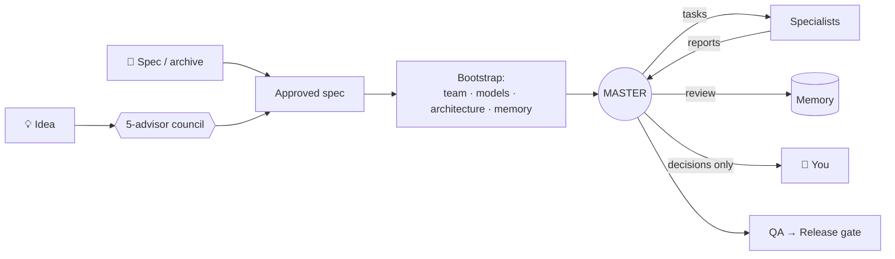

<div align="center">


[](https://docs.claude.com/en/docs/claude-code)
[](LICENSE)
[](https://github.com/alekseevdenis1995-ai/mastermind/stargazers)

**English** · [Русский](README.ru.md)

</div>

---

**Mastermind** is a Claude Code skill that turns a raw idea or a ready spec into a working AI team: one **Master** orchestrator, a set of **specialists** with clear roles and the right model each, a shared **project memory**, and an **autonomous loop** that runs the project while you only make the product decisions.

No more opening ten chats and pasting ten prompts by hand.

**Works in any agent harness:** Claude Code · Codex · Cursor · OpenCode · Gemini CLI · GitHub Copilot · Windsurf · Kiro · Factory · Amp · Goose · Cline · Kilo · and multi-agent launchers like **Orca**. Mastermind detects where it runs and **assigns models from the ones you actually have connected**.

## ✨ Why

| Without Mastermind | With Mastermind |
|---|---|
| You write the spec, design roles, write a prompt for every chat | `/mastermind` → answer a few questions |
| You copy tasks between chats and paste reports back | The Master sends tasks and collects reports itself |
| After `/clear` you paste the context again | A hook restores each chat's role automatically |
| Decisions live in chat history | Decisions, tasks and reports live in linked Markdown memory |
| You pick a model for every chat by hand | Roles get HEAVY / STANDARD / LIGHT tiers mapped to your connected models |

## 🔌 Works everywhere

| Harness | Mode A: subagents | Per-role model | Mode B: live sessions | Mode C: manual relay |
|---|:-:|:-:|:-:|:-:|
| Claude Code (CLI / IDE) | ✅ | ✅ `opus / sonnet / haiku` | — | ✅ |
| Claude Code **Desktop** | ✅ | ✅ | ✅ | ✅ |
| Codex CLI | ✅ | ✅ model + reasoning effort | — | ✅ |
| OpenCode | ✅ | ✅ any `provider/model` | — | ✅ |
| Gemini CLI | ✅ | ✅ Pro / Flash | — | ✅ |
| Cursor · Copilot · Kilo · Factory | ✅ | ✅ via agent files | — | ✅ |
| Windsurf · Kiro · Amp · Goose · Cline | ⚠️ varies | ⚠️ varies | — | ✅ |
| **Orca** and other worktree launchers | — | ✅ a different CLI per role | — | ✅ branch per role |

- **A — Subagents.** The Master spawns specialists itself. Where the harness supports agent files (`.claude/agents`, `.codex/agents`, `.opencode/agents`, `.cursor/agents`, `.gemini/agents`, `.github/agents`…), Mastermind generates a native agent per role with its model built in.
- **B — Live sessions.** Only in Claude Code Desktop: the Master finds your empty chats, renames them, sets their models and messages them.
- **C — Manual relay.** Works anywhere. The Master hands you copy-ready task blocks, and in **Orca** each role can run in a different CLI on its own `role/<ROLE>` branch, with the Master merging accepted work into `main`.

## 🚀 Install

The installer finds every agent harness on your machine and installs the skill into each one's skills folder.

**Windows** (PowerShell):

```powershell
irm https://raw.githubusercontent.com/alekseevdenis1995-ai/mastermind/main/install.ps1 | iex
```

**macOS / Linux:**

```bash
curl -fsSL https://raw.githubusercontent.com/alekseevdenis1995-ai/mastermind/main/install.sh | bash
```

<details>
<summary><b>Other ways</b>: Claude Code plugin, <code>npx skills</code>, git, ZIP</summary>

**As a Claude Code plugin**, run inside Claude Code:

```
/plugin marketplace add alekseevdenis1995-ai/mastermind
/plugin install mastermind@mastermind
```

**With the skills CLI** (27+ agents; pick one with `-a codex`, `-a cursor`, `-a opencode`…):

```bash
npx skills add alekseevdenis1995-ai/mastermind
```

**With git:**

```bash
git clone https://github.com/alekseevdenis1995-ai/mastermind
cd mastermind && ./install.sh        # Windows: .\install.ps1
```

**Manually:** download the [ZIP](https://github.com/alekseevdenis1995-ai/mastermind/archive/refs/heads/main.zip), then copy `skills/mastermind` to `~/.claude/skills/mastermind`.

</details>

**Requirements:** any agent harness that supports Agent Skills (`SKILL.md`). Optional:
- Python 3, for the Claude Code context-restore hook;
- the `llm-council` skill; without it a built-in council is used.

Mode B needs **Claude Code Desktop**.

## ▶️ Usage

Open Claude Code in an empty project folder and type:

```
/mastermind
```

Or just say *"I have a project idea, build me a team"*.


When the team is up, the Master audits the project and asks for a go:


## 🧭 How it works



1. **Intake.** Send a spec, or describe an idea. Ideas go through a council of five advisors, and the result becomes a sketch you edit or confirm.
2. **Models and mode.** Mastermind detects the harness and the models you have connected (Claude, GPT, Gemini, or whatever OpenCode, Goose or Orca expose). It maps them to **HEAVY / STANDARD / LIGHT** tiers, which you can adjust, then recommends mode A, B or C.
3. **Bootstrap.** It designs the *smallest effective team*: roles, ownership boundaries and a tier per role. It writes the whole project package: `AGENTS.md`, native agent files, starter prompts and memory.
4. **Run.** The Master audits the project, tells you what it did and where it will start, then after your *"yes"* loops through task, report, review, memory update and next task. You only hear from it for product decisions, blockers, pushes and deploys, and releases.

## 📁 What you get

```
your-project/
├── AGENTS.md             universal entry point, read by every harness
├── TEAM_MANIFEST.md      roles, ownership, tier / harness / model per role
├── PROJECT_PLAN.md       phases, milestones, risks
├── ARCHITECTURE.md
├── team/                 RUNTIME.md + starter prompts: 00_MASTER_START.md, 01_TECH_START.md …
├── memory/               context · state · decisions · questions · ideas · tasks · reports · ADR
├── specs/                approved spec + source material
└── .<harness>/agents/    native subagent per role with its model (mode A); Claude Code also gets a context-restore hook
```

> 💡 **Tip:** open the project folder in [Obsidian](https://obsidian.md). The memory is written with `[[wiki-links]]`, so you get a live graph of decisions, tasks and reports.

## 🧠 Principle

> **Bootstrap builds the team. The Master runs the project. Specialists execute the Master's tasks. Memory keeps the state. You make the decisions.**

## 🤝 Contributing

Issues and PRs are welcome. The skill lives in [`skills/mastermind/`](skills/mastermind): `SKILL.md` is the flow, `references/runtimes.md` covers harnesses and models, and `references/` also holds the protocol and prompt templates. Using a harness that isn't covered, or one whose format changed? PRs to `runtimes.md` are especially welcome.

If Mastermind saved you an evening of pasting prompts, **drop a ⭐**. It helps others find it.

## License

[MIT](LICENSE)
