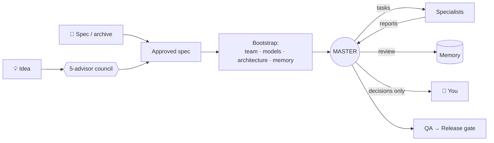

<div align="center">


[](https://docs.claude.com/en/docs/claude-code)
[](LICENSE)
[](https://github.com/alekseevdenis1995-ai/mastermind/stargazers)

**English** · [Русский](README.ru.md)

</div>

---

**Mastermind** is a Claude Code skill that turns a raw idea or a ready spec into a working AI team: one **Master** orchestrator, a set of **specialists** with clear roles and the right model each, a shared **project memory**, and an **autonomous loop** that runs the project while you only make the product decisions.

No more opening ten chats and pasting ten prompts by hand.

## ✨ Why

| Without Mastermind | With Mastermind |
|---|---|
| You write the spec, design roles, write a prompt for every chat | `/mastermind` → answer a few questions |
| You copy tasks between chats and paste reports back | The Master sends tasks and collects reports itself |
| After `/clear` you paste the context again | A hook restores each chat's role automatically |
| Decisions live in chat history | Decisions, tasks and reports live in linked Markdown memory |

## 🚀 Install

**Windows** (PowerShell):

```powershell
irm https://raw.githubusercontent.com/alekseevdenis1995-ai/mastermind/main/install.ps1 | iex
```

**macOS / Linux:**

```bash
curl -fsSL https://raw.githubusercontent.com/alekseevdenis1995-ai/mastermind/main/install.sh | bash
```

<details>
<summary><b>Other ways</b>: Claude Code plugin, <code>npx skills</code>, git, ZIP</summary>

**As a Claude Code plugin**, run inside Claude Code:

```
/plugin marketplace add alekseevdenis1995-ai/mastermind
/plugin install mastermind@mastermind
```

**With the skills CLI:**

```bash
npx skills add alekseevdenis1995-ai/mastermind
```

**With git:**

```bash
git clone https://github.com/alekseevdenis1995-ai/mastermind
cd mastermind && ./install.sh        # Windows: .\install.ps1
```

**Manually:** download the [ZIP](https://github.com/alekseevdenis1995-ai/mastermind/archive/refs/heads/main.zip), then copy `skills/mastermind` to `~/.claude/skills/mastermind`.

</details>

**Requirements:** [Claude Code](https://docs.claude.com/en/docs/claude-code) and Python 3 (for the context-restore hook). The `llm-council` skill is optional; without it a built-in council is used. Mode B (separate chats) needs **Claude Code Desktop**.

## ▶️ Usage

Open Claude Code in an empty project folder and type:

```
/mastermind
```

Or just say *"I have a project idea, build me a team"*.


When the team is up, the Master audits the project and asks for a go:


## 🧭 How it works



1. **Intake.** Send a spec, or describe an idea. Ideas go through a council of five advisors, and the result becomes a sketch you edit or confirm.
2. **Bootstrap.** Mastermind designs the *smallest effective team*: roles, ownership boundaries, and a model per role (Opus for architecture, Sonnet for implementation, Haiku for routine work). It writes the whole project package.
3. **Mode.** Mastermind recommends a mode and you pick one:
   - **A: Subagents.** Everything runs in one chat. The Master spawns specialists per task. Cheap and fully automatic.
   - **B: Real chats** (Claude Code Desktop). You open N empty chats. The Master finds them, renames them (`01 TECH`, `02 DESIGN`…), sets their models, assigns roles and messages them directly.
4. **Run.** The Master audits the project, tells you what it did and where it will start, then after your *"yes"* loops through task, report, review, memory update and next task. You only hear from it for product decisions, blockers, pushes and deploys, and releases.

## 📁 What you get

```
your-project/
├── TEAM_MANIFEST.md      roles, ownership, model per role
├── PROJECT_PLAN.md       phases, milestones, risks
├── ARCHITECTURE.md
├── team/                 starter prompts: 00_MASTER_START.md, 01_TECH_START.md …
├── memory/               context · state · decisions · questions · ideas · tasks · reports · ADR
├── specs/                approved spec + source material
└── .claude/              hook that restores a chat's role after /clear or compaction
```

> 💡 **Tip:** open the project folder in [Obsidian](https://obsidian.md). The memory is written with `[[wiki-links]]`, so you get a live graph of decisions, tasks and reports.

## 🧠 Principle

> **Bootstrap builds the team. The Master runs the project. Specialists execute the Master's tasks. Memory keeps the state. You make the decisions.**

## 🤝 Contributing

Issues and PRs are welcome. The skill lives in [`skills/mastermind/`](skills/mastermind): `SKILL.md` is the flow, and `references/` holds the protocol and prompt templates.

If Mastermind saved you an evening of pasting prompts, **drop a ⭐**. It helps others find it.

## License

[MIT](LICENSE)
