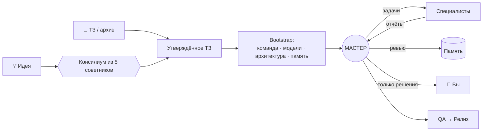

<div align="center">


[](https://docs.claude.com/en/docs/claude-code)
[](LICENSE)
[](https://github.com/alekseevdenis1995-ai/mastermind/stargazers)

[English](README.md) · **Русский**

</div>

---

**Mastermind** — скилл для Claude Code. Он превращает идею или готовое ТЗ в работающую AI-команду:
- один **Мастер**, который ведёт проект;
- **специалисты** с чёткими ролями и подходящей моделью для каждой роли;
- общая **память проекта**;
- **автономный цикл** работы, в котором от вас нужны только продуктовые решения.

Не нужно открывать десять чатов и вставлять в каждый стартовый промпт руками.

## ✨ Зачем

| Без Mastermind | С Mastermind |
|---|---|
| Сами пишете ТЗ, продумываете роли, пишете промпт для каждого чата | `/mastermind` и ответы на пару вопросов |
| Копируете задачи между чатами и носите отчёты обратно | Мастер сам отправляет задачи и собирает отчёты |
| После `/clear` снова вставляете контекст | Хук сам возвращает чату его роль |
| Решения теряются в переписке | Решения, задачи и отчёты лежат в связанной памяти (Markdown) |

## 🚀 Установка

**Windows** (PowerShell):

```powershell
irm https://raw.githubusercontent.com/alekseevdenis1995-ai/mastermind/main/install.ps1 | iex
```

**macOS / Linux:**

```bash
curl -fsSL https://raw.githubusercontent.com/alekseevdenis1995-ai/mastermind/main/install.sh | bash
```

<details>
<summary><b>Другие способы</b>: плагин Claude Code, <code>npx skills</code>, git, ZIP</summary>

**Как плагин.** Выполните внутри Claude Code:

```
/plugin marketplace add alekseevdenis1995-ai/mastermind
/plugin install mastermind@mastermind
```

**Через skills CLI:**

```bash
npx skills add alekseevdenis1995-ai/mastermind
```

**Через git:**

```bash
git clone https://github.com/alekseevdenis1995-ai/mastermind
cd mastermind && ./install.sh        # Windows: .\install.ps1
```

**Вручную.** Скачайте [ZIP](https://github.com/alekseevdenis1995-ai/mastermind/archive/refs/heads/main.zip) и скопируйте папку `skills/mastermind` в `~/.claude/skills/mastermind`.

</details>

**Что нужно:**
- [Claude Code](https://docs.claude.com/en/docs/claude-code);
- Python 3 — на нём работает хук восстановления контекста;
- скилл `llm-council` — по желанию, без него используется встроенный консилиум;
- для режима B (отдельные чаты) — **Claude Code Desktop**.

## ▶️ Как пользоваться

Откройте Claude Code в пустой папке проекта и напишите:

```
/mastermind
```

Или просто: *«у меня идея проекта, собери команду»*.


Когда команда собрана, Мастер проводит аудит и спрашивает разрешения начать:


## 🧭 Как это работает



1. **Вход.** Пришлите ТЗ или опишите идею. Идею разбирает консилиум из пяти советников, получается набросок, который вы правите или подтверждаете.
2. **Bootstrap.** Mastermind проектирует *минимальную эффективную команду*: роли, границы ответственности и модель для каждой роли (Opus — архитектура, Sonnet — реализация, Haiku — рутина). Затем создаёт весь пакет проекта.
3. **Режим.** Скилл рекомендует режим, вы выбираете:
   - **A — сабагенты.** Всё в одном чате, Мастер сам запускает специалиста под каждую задачу. Дёшево и полностью автоматически.
   - **B — отдельные чаты** (Claude Code Desktop). Вы открываете N пустых чатов. Мастер сам их находит, переименовывает (`01 TECH`, `02 DESIGN`…), ставит модели, раздаёт роли и общается с ними напрямую.
4. **Работа.** Мастер проводит аудит и сообщает, что сделал и с чего начнёт. После вашего «да» он идёт по циклу: задача, отчёт, ревью, обновление памяти, следующая задача. Вам он пишет только когда нужно ваше решение: продуктовые вопросы, блокеры, push и деплой, релиз.

## 📁 Что появится в проекте

```
your-project/
├── TEAM_MANIFEST.md      роли, зоны, модель для каждой роли
├── PROJECT_PLAN.md       фазы, вехи, риски
├── ARCHITECTURE.md
├── team/                 стартовые промпты: 00_MASTER_START.md, 01_TECH_START.md …
├── memory/               контекст · состояние · решения · вопросы · идеи · задачи · отчёты · ADR
├── specs/                ТЗ и исходные материалы
└── .claude/              хук: возвращает чату роль после /clear или сжатия
```

> 💡 **Совет:** откройте папку проекта в [Obsidian](https://obsidian.md). Память написана со ссылками `[[...]]`, поэтому вы увидите граф решений, задач и отчётов.

## 🧠 Принцип

> **Bootstrap собирает команду. Мастер ведёт проект. Специалисты выполняют задачи Мастера. Память хранит состояние. Решения принимаете вы.**

## 🤝 Участие

Issues и PR приветствуются. Скилл лежит в [`skills/mastermind/`](skills/mastermind): `SKILL.md` описывает сценарий, в `references/` — протокол и шаблоны промптов.

Если Mastermind сэкономил вам вечер копирования промптов, **поставьте ⭐**: так его найдут другие.

## Лицензия

[MIT](LICENSE)
