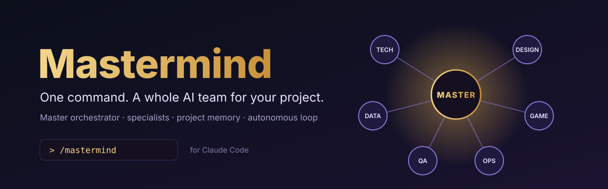
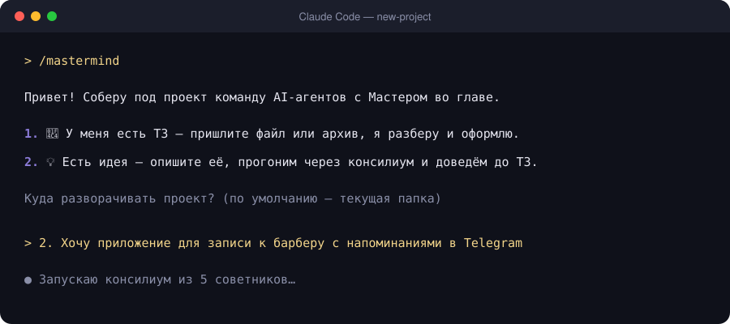
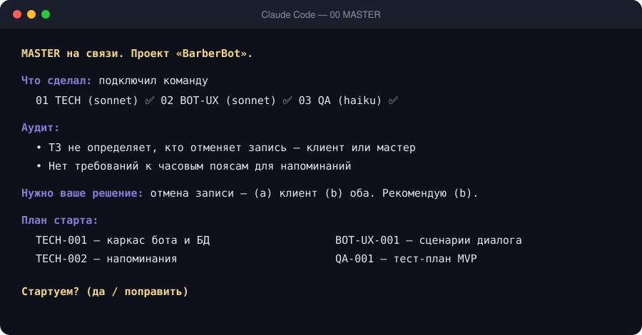
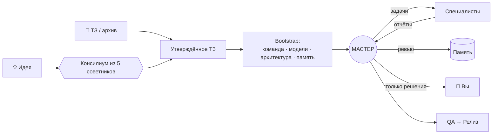

<div align="center">



[](https://docs.claude.com/en/docs/claude-code)
[](LICENSE)
[](https://github.com/alekseevdenis1995-ai/mastermind/stargazers)

[English](README.md) · **Русский**

</div>

---

**Mastermind** — скилл для Claude Code. Он превращает идею или готовое ТЗ в работающую AI-команду:
- один **Мастер**, который ведёт проект;
- **специалисты** с чёткими ролями и подходящей моделью для каждой роли;
- общая **память проекта**;
- **автономный цикл** работы, в котором от вас нужны только продуктовые решения.

Не нужно открывать десять чатов и вставлять в каждый стартовый промпт руками.

**Работает в любой агентной среде:** Claude Code · Codex · Cursor · OpenCode · Gemini CLI · GitHub Copilot · Windsurf · Kiro · Factory · Amp · Goose · Cline · Kilo, а также в мультиагентных оболочках вроде **Orca**. Mastermind сам определяет, где запущен, и **назначает модели из тех, что у вас реально подключены**.

## ✨ Зачем

| Без Mastermind | С Mastermind |
|---|---|
| Сами пишете ТЗ, продумываете роли, пишете промпт для каждого чата | `/mastermind` и ответы на пару вопросов |
| Копируете задачи между чатами и носите отчёты обратно | Мастер сам отправляет задачи и собирает отчёты |
| После `/clear` снова вставляете контекст | Хук сам возвращает чату его роль |
| Решения теряются в переписке | Решения, задачи и отчёты лежат в связанной памяти (Markdown) |
| Модель для каждого чата выбираете вручную | Роли получают уровни HEAVY / STANDARD / LIGHT, которые сопоставляются с вашими подключёнными моделями |

## 🔌 Работает везде

| Среда | Режим A: сабагенты | Модель на роль | Режим B: живые чаты | Режим C: ручная передача |
|---|:-:|:-:|:-:|:-:|
| Claude Code (CLI / IDE) | ✅ | ✅ `opus / sonnet / haiku` | — | ✅ |
| Claude Code **Desktop** | ✅ | ✅ | ✅ | ✅ |
| Codex CLI | ✅ | ✅ модель + глубина рассуждений | — | ✅ |
| OpenCode | ✅ | ✅ любая `provider/model` | — | ✅ |
| Gemini CLI | ✅ | ✅ Pro / Flash | — | ✅ |
| Cursor · Copilot · Kilo · Factory | ✅ | ✅ через файлы агентов | — | ✅ |
| Windsurf · Kiro · Amp · Goose · Cline | ⚠️ по-разному | ⚠️ по-разному | — | ✅ |
| **Orca** и другие оболочки с worktree | — | ✅ своя CLI для каждой роли | — | ✅ ветка на роль |

- **A — сабагенты.** Мастер сам запускает специалистов. Если среда поддерживает файлы агентов (`.claude/agents`, `.codex/agents`, `.opencode/agents`, `.cursor/agents`, `.gemini/agents`, `.github/agents`…), для каждой роли создаётся родной агент с уже прописанной моделью.
- **B — живые чаты.** Только Claude Code Desktop: Мастер находит ваши пустые чаты, переименовывает их, ставит модели и пишет им сам.
- **C — ручная передача.** Работает где угодно. Мастер выдаёт готовые блоки задач, вы их копируете. В **Orca** каждая роль может работать в своей CLI на своей ветке `role/<ROLE>`, а Мастер вливает принятую работу в `main`.

## 🚀 Установка

Установщик находит все агентные среды на компьютере и ставит скилл в папку скиллов каждой.

**Windows** (PowerShell):

```powershell
irm https://raw.githubusercontent.com/alekseevdenis1995-ai/mastermind/main/install.ps1 | iex
```

**macOS / Linux:**

```bash
curl -fsSL https://raw.githubusercontent.com/alekseevdenis1995-ai/mastermind/main/install.sh | bash
```

<details>
<summary><b>Другие способы</b>: плагин Claude Code, <code>npx skills</code>, git, ZIP</summary>

**Как плагин.** Выполните внутри Claude Code:

```
/plugin marketplace add alekseevdenis1995-ai/mastermind
/plugin install mastermind@mastermind
```

**Через skills CLI** (27+ агентов; конкретный выбирается через `-a codex`, `-a cursor`, `-a opencode`…):

```bash
npx skills add alekseevdenis1995-ai/mastermind
```

**Через git:**

```bash
git clone https://github.com/alekseevdenis1995-ai/mastermind
cd mastermind && ./install.sh        # Windows: .\install.ps1
```

**Вручную.** Скачайте [ZIP](https://github.com/alekseevdenis1995-ai/mastermind/archive/refs/heads/main.zip) и скопируйте папку `skills/mastermind` в `~/.claude/skills/mastermind`.

</details>

**Что нужно:**
- любая среда с поддержкой Agent Skills (`SKILL.md`);
- Python 3 — по желанию, для хука восстановления контекста в Claude Code;
- скилл `llm-council` — по желанию, без него используется встроенный консилиум;
- для режима B (отдельные чаты) — **Claude Code Desktop**.

## ▶️ Как пользоваться

Откройте Claude Code в пустой папке проекта и напишите:

```
/mastermind
```

Или просто: *«у меня идея проекта, собери команду»*.



Когда команда собрана, Мастер проводит аудит и спрашивает разрешения начать:



## 🧭 Как это работает



1. **Вход.** Пришлите ТЗ или опишите идею. Идею разбирает консилиум из пяти советников, получается набросок, который вы правите или подтверждаете.
2. **Модели и режим.** Mastermind определяет среду и подключённые модели: Claude, GPT, Gemini или то, что дают OpenCode, Goose и Orca. Он раскладывает их по уровням **HEAVY / STANDARD / LIGHT** (вы можете поправить) и рекомендует режим A, B или C.
3. **Bootstrap.** Проектирует *минимальную эффективную команду*: роли, границы ответственности, уровень для каждой роли. Затем создаёт пакет проекта: `AGENTS.md`, родные файлы агентов, стартовые промпты и память.
4. **Работа.** Мастер проводит аудит и сообщает, что сделал и с чего начнёт. После вашего «да» он идёт по циклу: задача, отчёт, ревью, обновление памяти, следующая задача. Вам он пишет только когда нужно ваше решение: продуктовые вопросы, блокеры, push и деплой, релиз.

## 📁 Что появится в проекте

```
your-project/
├── AGENTS.md             общая точка входа, её читает любая среда
├── TEAM_MANIFEST.md      роли, зоны, уровень / среда / модель для каждой роли
├── PROJECT_PLAN.md       фазы, вехи, риски
├── ARCHITECTURE.md
├── team/                 RUNTIME.md + стартовые промпты: 00_MASTER_START.md, 01_TECH_START.md …
├── memory/               контекст · состояние · решения · вопросы · идеи · задачи · отчёты · ADR
├── specs/                ТЗ и исходные материалы
└── .<среда>/agents/      родной сабагент на роль со своей моделью (режим A); в Claude Code ещё и хук восстановления контекста
```

> 💡 **Совет:** откройте папку проекта в [Obsidian](https://obsidian.md). Память написана со ссылками `[[...]]`, поэтому вы увидите граф решений, задач и отчётов.

## 🧠 Принцип

> **Bootstrap собирает команду. Мастер ведёт проект. Специалисты выполняют задачи Мастера. Память хранит состояние. Решения принимаете вы.**

## 🤝 Участие

Issues и PR приветствуются. Скилл лежит в [`skills/mastermind/`](skills/mastermind): `SKILL.md` описывает сценарий, `references/runtimes.md` — среды и модели, в `references/` также лежат протокол и шаблоны промптов. Ваша среда не описана или у неё поменялся формат? PR в `runtimes.md` особенно приветствуются.

Если Mastermind сэкономил вам вечер копирования промптов, **поставьте ⭐**: так его найдут другие.

## Лицензия

[MIT](LICENSE)
